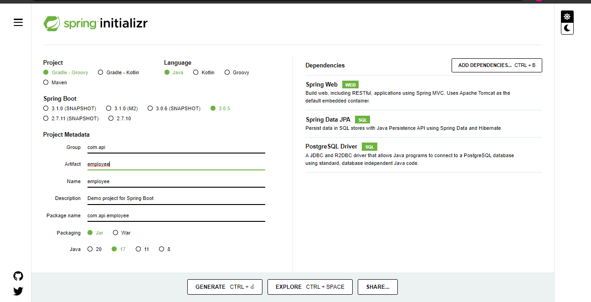
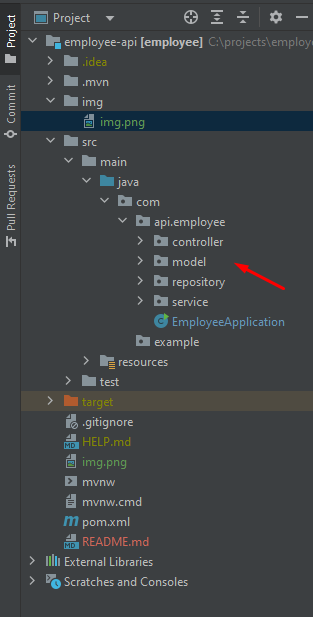
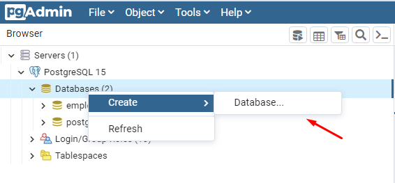
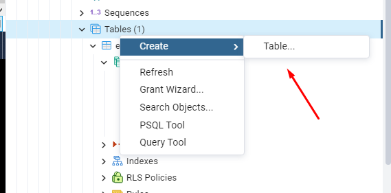
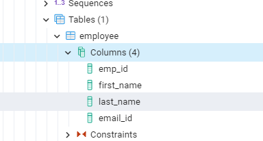

# Employee Rest Api Spring Boot

Neste tutorial, nós iremos desenvolver uma API REST no Sping Boot para executar operações CRUD em banco de dados "employee"

### Pré-requisitos

* [Java Development kit(JDK) versão 8](https://www.oracle.com/java/technologies/downloads/) ou superior
* [Maven](https://maven.apache.org/download.cgi) 3.3 ou superior
* [PostgreSQL](https://www.postgresql.org/) é o serviço de banco de dados que usamos para armazenar os dados do Employee
* Uma IDE de sua preferência, eu estou usando o [Intellij](https://www.jetbrains.com/idea/download/#section=windows)
* [Postman](https://www.postman.com/downloads/) para testar a API. 

### Vantangens de usar o Spring Boot
Spring Boot é um framework de Java, usado para desenvolver aplicações web. Ele permite que você crie REST API com configurações
mínimas. 

### Criando e importando o projeto Spring Boot

Para criar um projeto Spring Boot, você pode usar o [Spring Intializr](https://start.spring.io/). Esta ferramenta proverá 
uma estrutura básica de um projeto Spring Boot.

Vá para o [site Spring Intializr](https://start.spring.io/) na aba Project selecione Maven, Language Java. A versão do
Spring Boot que estou usando é a 3.0.5 e a versão do Java 17. Escolha Packaging Jar.

Adicione as seguintes dependências ao projeto:
* Spring web
* Spring Data JPA
* Postgre SQL Driver

Sua aplicação Spring Boot estará parecida conforme imagem abaixo:


Click em Generate e um arquivo zip será baixado. Extraia o arquivo e importe para a sua IDE. 

### Estrutura do projeto

No package com.api.employee adicione os seguintes sub-packages:
* **repository**: Essa camada é semelhante à camada DAO que se connecta ao banco de dados e acessa os dados.
No entanto, a camada de repository fornece uma abstração maior em comparação com a camada DAO. Cada classe é
responável por acessar e manipular uma entidade. 

* **service**: esta camada chama a camada repository para obter e executar a lógica de negócios nela. Nesta api
estamos executando os métodos de criar, atualizar, listar e deletar os dados de um "employee".

* **model**: a camada modelo contém todos os objetos Java que serão mapeados para a tabela de banco de dados.
O repository buscará os dados do banco de dados e preencherá o respectivo modelo com esses dados e os retornará
à camada de serviço e vice-versa.

* **controller**: essa é a camada superior, chamada quando chega uma solicitação para determinada API REST. O
controller processará a solicitação da API REST, chamará um ou mais serviços e retornará uma resposta HTTP ao cliente.



### Criando a tabela no banco de dados Postgres
Para o banco de dados Postgres estou usando o pgAdmin4. Acesse o banco de dados e crie um novo Database conforme imgem
abaixo:

Após criar o Database, crie a tabela

Por último, crie as colunas.



### Conectando o Postgres na aplicação

Para conectar o Postgres na aplicação, você terá que fornecer detalhes do banco de dados para o Spring Boot. 
Abra o arquivo application.properties na pasta **src/main/resources/application.properties** e adicione o conteúdo abaixo:

```
spring.datasource.url=jdbc:postgresql://localhost:5432/employee
spring.datasource.username=<userrname>
spring.datasource.password=<password>
````

## Criando a API

### Criando a classe na camada model
Na IDE click em **com.api.employee.model** package para criar uma nova classe. Preencha o campo de nome com "Employee" e
pressione enter.
Na classe Employee iremos adicionar o seguinte código:

```bash
package com.api.employee.model;

import jakarta.persistence.*;

@Entity
@Table(name = "employee")
public class Employee {
    @Id
    @GeneratedValue(strategy = GenerationType.IDENTITY)
    @Column(name="emp_id")
    private Long id;

    @Column(name="first_name")
    private String firstName;

    @Column(name="last_name")
    private String lastName;

    @Column(name="email_id")
    private String emailId;
}
````

Após emailId crie os getters e setters clicando com o botão direito na página selecione Generate e depois Getter and Setter
selecione todos para criar automático.

### Criando a classe na camada repository
Crie uma classe chamada EmployeeRepository no package **com.api.employee.repository** e adicione o seguinte código:

```bash
package com.api.employee.repository;

import com.api.employee.model.Employee;
import org.springframework.data.jpa.repository.JpaRepository;
import org.springframework.stereotype.Repository;

@Repository
public interface EmployeeRepository extends JpaRepository<Employee, Long> {
}

```
### Criando a classe na camada service

No service contém a lógica do negócio. Crie uma classe chamada EmployeeService no package **com.api.employee.service**
e adicione o código abaixo:

````bash
package com.api.employee.service;

import com.api.employee.repository.EmployeeRepository;
import com.api.employee.model.Employee;
import org.springframework.beans.factory.annotation.Autowired;
import org.springframework.stereotype.Service;

import java.util.List;

@Service
public class EmployeeService {
    @Autowired
    EmployeeRepository empRepository;

    public Employee createEmployee(Employee emp){
        return empRepository.save(emp);
    }

    public List<Employee> getEmployees(){
        return empRepository.findAll();
    }

    public void deleteEmployee(Long empId){
        empRepository.deleteById(empId);
    }

    public Employee updateEmployee(Long empId, Employee employeeDetails){
        Employee emp = empRepository.findById(empId).get();
        emp.setFirstName(employeeDetails.getFirstName());
        emp.setLastName(employeeDetails.getLastName());
        emp.setEmailId(employeeDetails.getEmailId());

        return empRepository.save(emp);
    }
}
````
Cada um desses métodos irá chamar JpaRepository estendidos por EmployeeRepository.

### Criando a classe na camada controller

Crie uma classe chamada EmployeeController no package **com.api.employee.controller** e adicione o seguinte código:

````bash
package com.api.employee.controller;

import com.api.employee.model.Employee;
import com.api.employee.service.EmployeeService;
import org.springframework.beans.factory.annotation.Autowired;
import org.springframework.web.bind.annotation.*;
import java.util.List;

@RestController
@RequestMapping("/api")
public class EmployeeController {
    @Autowired
    EmployeeService empService;
    @RequestMapping(value = "/employee", method = RequestMethod.POST)
    public Employee createEmployee(@RequestBody Employee emp){
        return empService.createEmployee(emp);
    }

    @RequestMapping(value = "/employees", method = RequestMethod.GET)
    public List<Employee> readEmployees(){
        return empService.getEmployees();
    }

    @RequestMapping(value = "/employee/{empId}", method = RequestMethod.PUT)
    public Employee updateEmployee(@PathVariable(value = "empId") Long id, @RequestBody Employee empDetails ){
        return empService.updateEmployee(id, empDetails);
    }

    @RequestMapping(value = "/employee/{empId}", method = RequestMethod.DELETE)
    public void deleteEmployee(@PathVariable(value = "empId") Long id){
        empService.deleteEmployee(id);
    }
}

````

Em contrução :	🚧